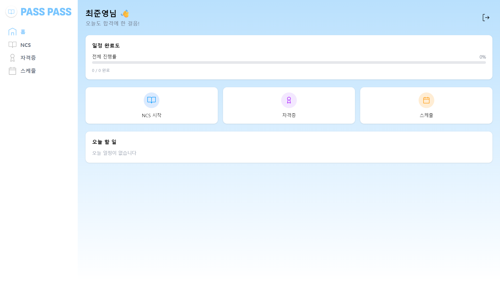
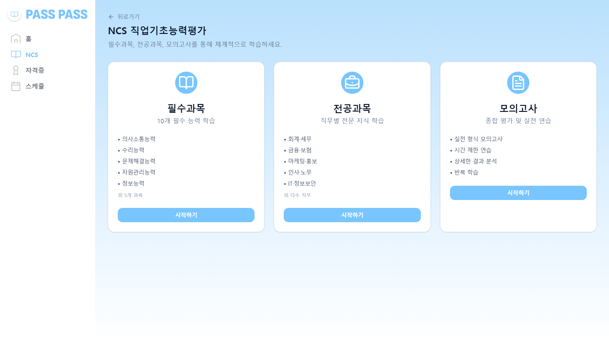
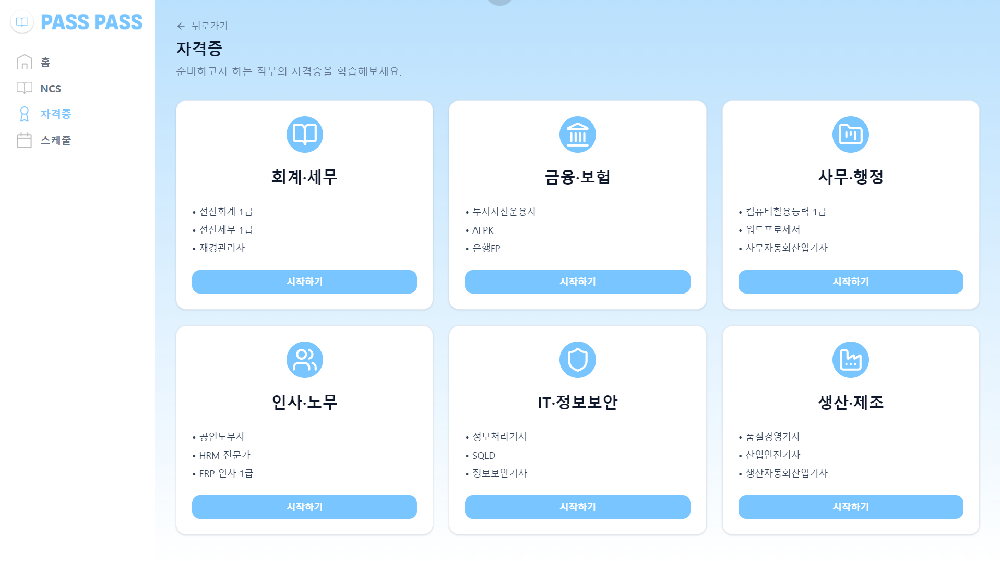
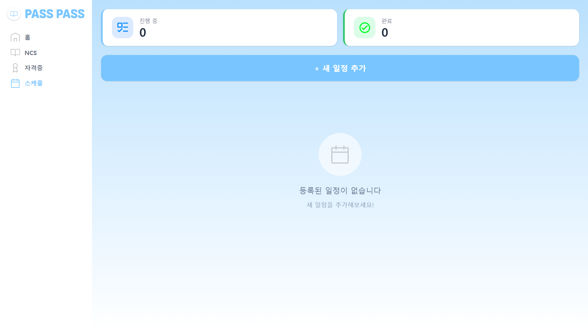
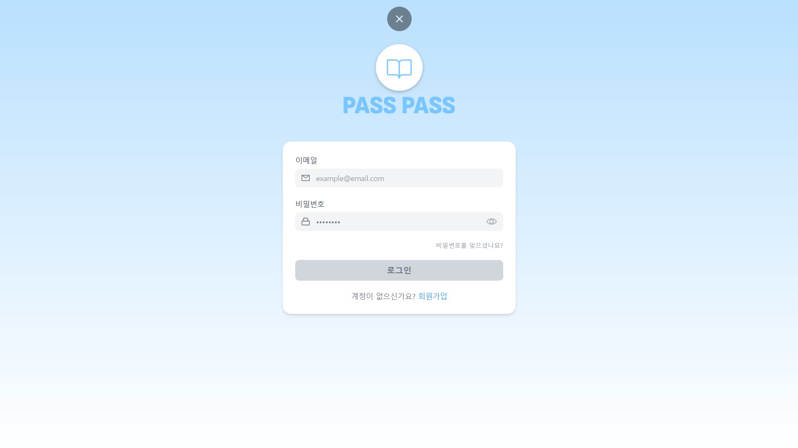
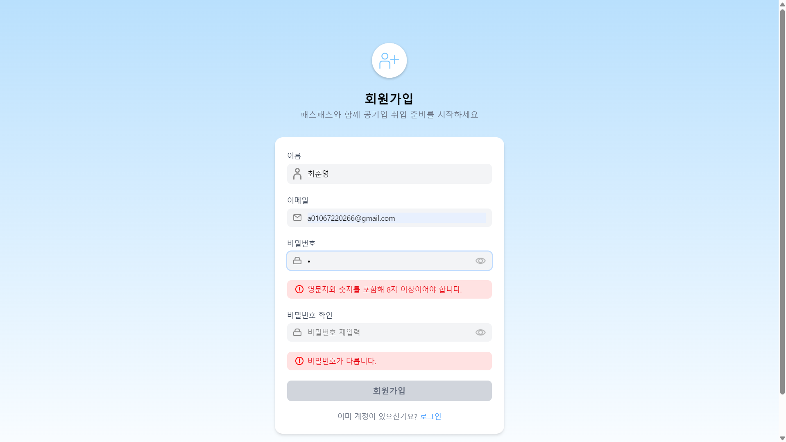
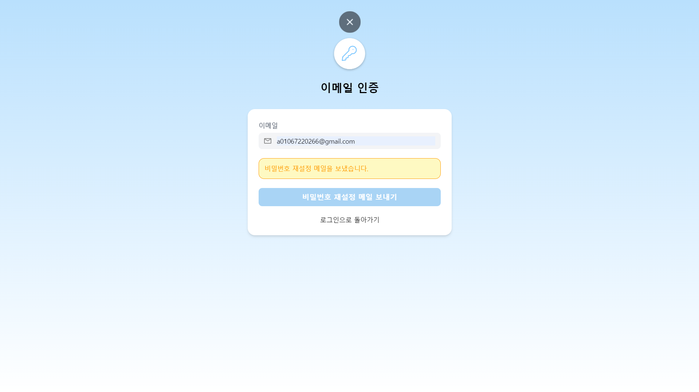

# 패스패스

공기업 취업 준비생을 위한

**NCS 직업기초능력 + 직무별 자격증** 학습 서비스

문제 풀이, 모의고사, 결과 분석, 일정 편성을 통해

체계적인 학습 경험을 제공합니다.

링크: https://pass-pass-viym.vercel.app/welcome

## 💡 기획 배경

공기업 취업 준비 과정에서는 NCS와 자격증 준비가 동시에 요구됩니다.

하지만 기존 학습 방식은

- NCS와 자격증 사이트가 분리
- 체계적인 학습 흐름이 부족

이런 문제를 해결하기 위해 NCS 직업기초능력과 직무별 자격증, 일정 편성을 한 번에 할 수 있는 웹 애플리케이션을 개발했습니다.

## 🚀 주요 기능

- 메인 화면
  
  

  - NCS 학습 선택
  - 자격증 학습 선택
  - 일정 편성
  - 로그아웃

- NCS 풀이
  
  [](./src/assets/readme/video1.mp4)

- 자격증 풀이
  
  [](./src/assets/readme/video1.mp4)

- 일절 편성

  [](./src/assets/readme/video3.mp4)

- 로그인
  
  

  - 이메일 로그인
  
- 회원가입

  

  - 이름
  - 이메일
  - 비밀번호
  - 비밀번호 확인
  
- 비밀번호 재설정
  
  

  - 자신의 이메일로 비밀번호 재설정 메일 발송
  
## 🧭 서비스 흐름

```
NCS / 자격증 선택 => 과목 선택 => 문제 풀이 => 결과 확인
```

## 🛠️ 기술 스택

- FrontEnd
  
    
    
    
    

- Server

    


- Development Tools

    
    
    

- Deploy

    

## 🧱 구조 설계

본 프로젝트는 **재사용성과 확장성**을 고려하여 설계되었습니다.

- 공용 ResultPage로 결과 처리 일원화
- NCS / 자격증 기능을 동일한 UX 흐름으로 구성

## 🤔 트러블 슈팅

### 1. 결과 페이지 경로 문제

- 문제: NCS와 자격증 결과 이동 경로 충돌
- 해결: 결과 상태 `ResultState`에 `retryPath`, `mainPath`를 포함하여 공용 처리
  
### 2. 뒤로가기 UX 문제

- 문제: `navigate(-1)`사용 시 흐름이 꼬이는 문제 발생
- 해결: 명확한 경로 지정 방식으로 개선

### 3. 공용 컴포넌트 설계

- 문제: 기능별 코드 중복 발생
- 해결: `Result`, `StudyCard`등 컴포넌트 공용화

## 🎯 기대 효과
- NCS + 자격증 통합 학습 가능
- 체계적인 문제 풀이 경험 제공
- 취업 준비 효율성 향상

## 향후 개선
- 제대로 된 백엔드 구축
- AI 기반 자기소개서 피드백 기능 확장
- 사용자 학습 데이터(정답률, 문제 풀이 기록) 저장 및 분석 기능 추가
- NCS 과목, 직무 수, 직무 관련 자격증 문제 추가
- 실제 공기업 시험 환경 확인 후 학습 환경 변경

## 🔥 Firebase 설정

본 프로젝트는 Firebase를 사용하고 있으며,

보안상 Firebase 설정 값은 GitHub에 포함되어 있지 않습니다.

프로젝트를 실행하려면 루트 경로에 .env 파일을 생성하고

아래 환경 변수를 설정해야 합니다.

```
🔑 환경 변수 설정 (.env)
VITE_FIREBASE_API_KEY=your_api_key
VITE_FIREBASE_AUTH_DOMAIN=your_auth_domain
VITE_FIREBASE_PROJECT_ID=your_project_id
VITE_FIREBASE_STORAGE_BUCKET=your_storage_bucket
VITE_FIREBASE_MESSAGING_SENDER_ID=your_sender_id
VITE_FIREBASE_APP_ID=your_app_id
```

.env 파일은 보안상 Git에 포함되어 있지 않습니다.
필요 시 .env.example 파일을 참고하여 설정해주세요.

## ▶ 실행 방법

```
npm install
npm run dev
```
